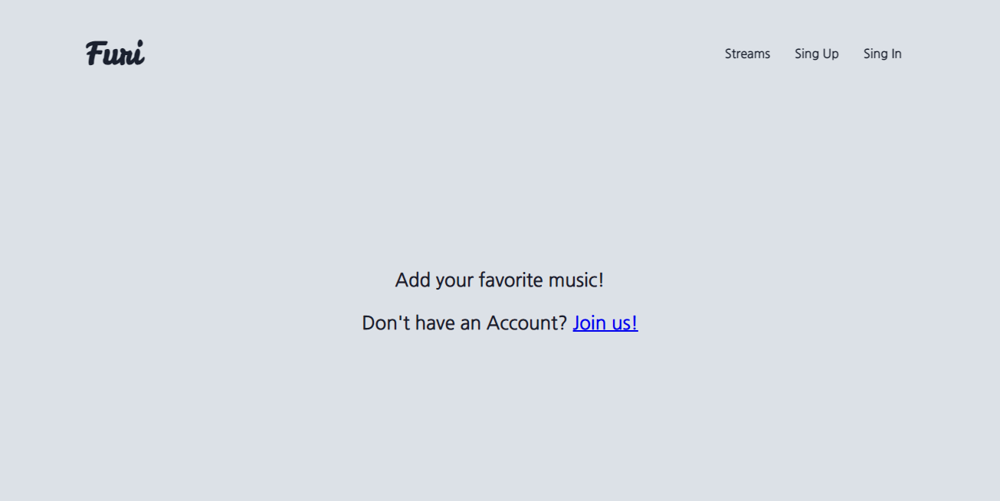
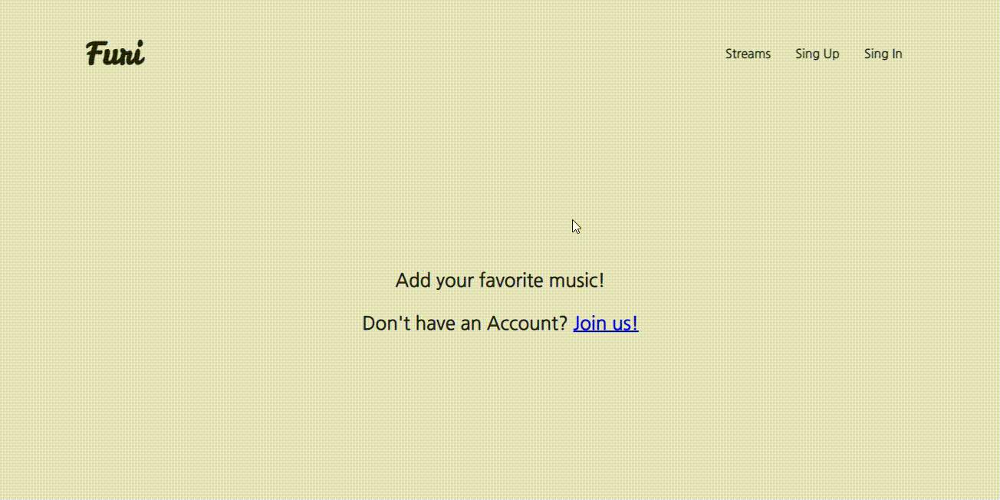
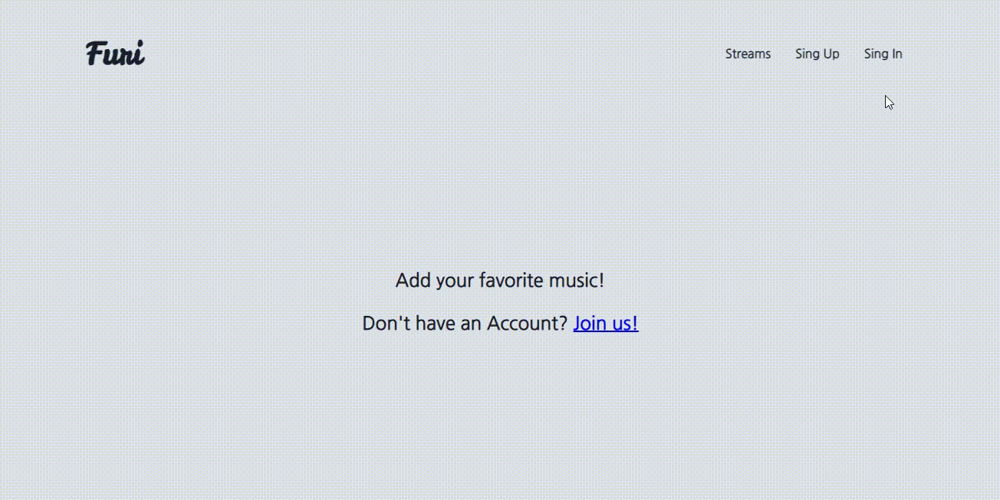
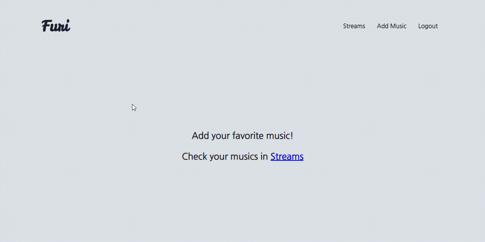
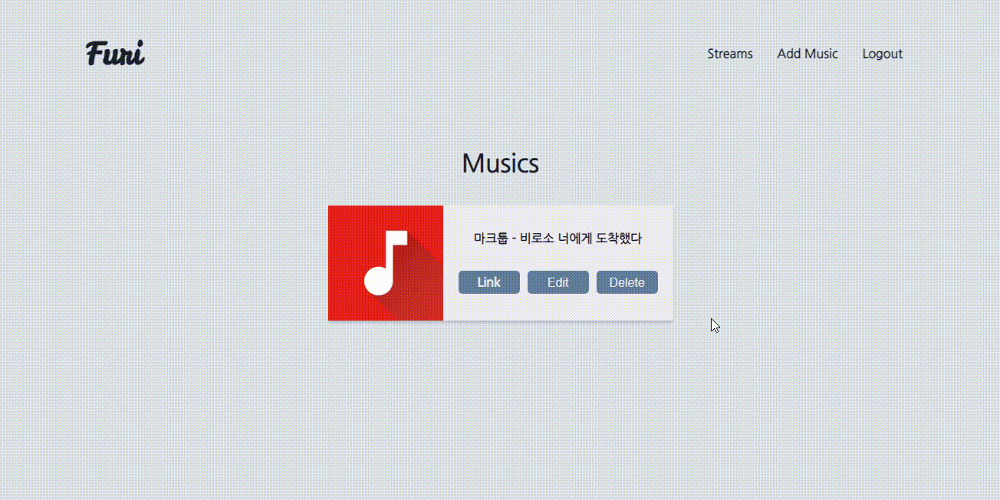

# MusicWeb

React를 이용한 간단한 CRUD 웹사이트 입니다.

좋아하는 음악을 등록합니다.

## Installation


### 서버 설치

```
npm install
```

### 클라이언트 설치

```
cd client
npm install
```

### 실행

```
npm run frontend // 클라이언트 실행
npm run backend // 서버 실행
npm run dev // 클라이언트 & 서버 실행
```

## Description


### 메인화면



### 회원가입



### 로그인



### 음악 - 추가



### 음악 - 확인


